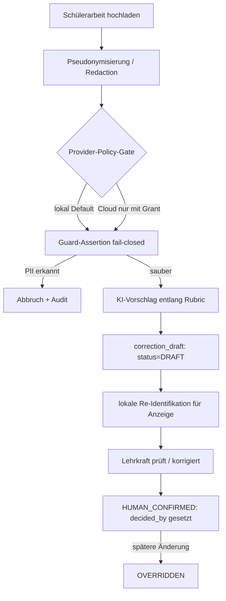
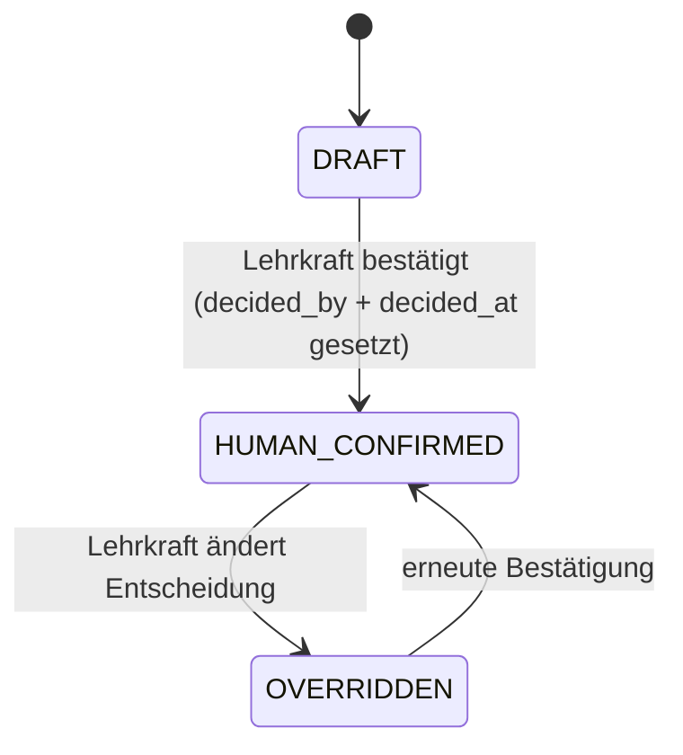

# Korrekturworkflow — Spezifikation (M3)

> **Roadmap-Issue #21** · Milestone **M3 – Korrektur & Datenschutz** · Priorität **p1**
> Status: **Planung** (Spezifikation; Implementierung folgt in M3).

Dieser Plan spezifiziert den Korrekturworkflow: von der pseudonymisierten Schülerarbeit über die KI-gestützte Vorschlagserstellung bis zur **verpflichtenden menschlichen Finalentscheidung**. Das System vergibt **keine** verbindlichen Noten und übernimmt keinen KI-Vorschlag automatisch.

Bindende Grundsätze (siehe `AGENTS.md`): Datensparsamkeit, Local-first, **menschliche Finalentscheidung**. Abhängigkeiten: Pseudonymisierung/Redaction ([`../security/REDACTION_AND_GUARD_SPEC.md`](../security/REDACTION_AND_GUARD_SPEC.md), Issue #22, abgeschlossen), Local-first Schülerdaten ([ADR 0004](../adr/0004-local-first-student-data.md)), Pseudonym-Retention ([ADR 0009](../adr/0009-pseudonym-retention.md)).

## Datenklassifizierung

Schülerarbeiten sind `SENSITIVE_STUDENT`. Klarnamen verlassen das System **nie**. Ein Cloud-LLM darf nur mit dokumentiertem `CloudReleaseGrant` (Rechtsgrundlage, AVV, DSFA) und ausschließlich auf **pseudonymisiertem + redigiertem** Text aufgerufen werden.

## Datenmodell (Ist-Stand)

Der Workflow stützt sich auf das bestehende Schema in `src/lib/db/schema/corrections.ts`:

- **`student_submission`** — `pseudonym_id` (z. B. `SCHUELER_08_017`), `content_ref` (MinIO), optional `ocr_text_ref`, `task_id`, `owner_teacher_id`. Enthält **keinen** Klarnamen.
- **`correction_draft`** — `submission_id`, `rubric_id`, `ai_suggestion` (`FeedbackStatement[]`), `provenance`, `human_decision`, `decided_by` (FK auf `user`), `decided_at`, `status`, `history`, `owner_teacher_id`.
- **`correction_status`** Enum: `DRAFT` → `HUMAN_CONFIRMED` → `OVERRIDDEN`.

## Workflow-Schritte

1. **Erfassung** — Lehrkraft lädt die Schülerarbeit hoch. Bereits bei der Erfassung wird ein **Pseudonym** (`pseudonym_id`) vergeben; die Datei landet als `content_ref` im lokalen Object Store (MinIO). Scan-Arbeiten werden per OCR zu `ocr_text_ref` extrahiert (Bezug Issue #40).
2. **Pseudonymisierung / Redaction** — vor jeder KI-Anfrage durchläuft der Text die lokale Pseudonymisierungs-/Redaction-Pipeline ([`REDACTION_AND_GUARD_SPEC.md`](../security/REDACTION_AND_GUARD_SPEC.md)): Klarnamen, Klassen-/Ortsbezüge und weitere direkte Identifikatoren werden ersetzt/entfernt. Die Klarname↔Pseudonym-Zuordnung bleibt **lokal** (ADR 0009).
3. **Provider-Policy-Gate** — Default ist der lokale Provider. Ein Cloud-LLM wird nur bei vorhandenem `CloudReleaseGrant` aufgerufen.
4. **Guard-Assertion (fail-closed)** — vor dem Provider-Call bricht die Guard ab, falls noch PII im Text nachweisbar ist. Diese Assertion wird nie umgangen oder abgeschwächt.
5. **KI-Vorschlag** — das Modell erzeugt entlang des Bewertungsrasters (`rubric_id`) Feedback als `ai_suggestion` (`FeedbackStatement[]`) **mit Begründungen, Unsicherheiten und Quellen-/Confidence-Markierung** — keinen verbindlichen Notenwert. `provenance` hält Provider, Modell, Kontext und Zitate fest.
6. **Erstanlage** — der `correction_draft` wird mit `status = DRAFT` persistiert. In diesem Zustand ist der Vorschlag **unbestätigt** und ausdrücklich als „zu prüfen" markiert.
7. **Re-Identifikation** — nur auf dem lokalen Pfad wird der pseudonymisierte Text für die Anzeige an die Lehrkraft re-identifiziert.
8. **Menschliche Finalentscheidung** — die Lehrkraft prüft, korrigiert ggf. (`human_decision`) und bestätigt. Erst dadurch wechselt der Status (siehe Statusregeln). Spätere Änderungen führen zu `OVERRIDDEN`.
9. **Provenienz-/Audit-Logging** — jeder Übergang wird in `history` und im Audit-Log festgehalten (wer, wann, was).

## Statusregeln (verpflichtende menschliche Finalentscheidung)

- Der Übergang **`DRAFT` → `HUMAN_CONFIRMED` ist nur zulässig, wenn `decided_by` (eine reale Lehrkraft) und `decided_at` gesetzt sind.** Das System darf diesen Übergang **niemals automatisch** auslösen — kein Job, kein Default, kein KI-Pfad setzt `HUMAN_CONFIRMED`.
- Solange `status = DRAFT`, ist der Vorschlag rechtlich/pädagogisch **unverbindlich**.
- Korrekturen nach Bestätigung erzeugen `OVERRIDDEN` (mit neuem `decided_by`/`decided_at`), nie eine stille Überschreibung.
- Durchsetzung: Anwendungslogik + DB-Constraint/Check (z. B. `status = 'HUMAN_CONFIRMED'` erfordert `decided_by IS NOT NULL AND decided_at IS NOT NULL`); Änderungen laufen über benannte Repository-Methoden, nicht ad-hoc.

## Keine automatische Notenvergabe

- `ai_suggestion` enthält **qualitatives, rasterbezogenes Feedback** mit Begründungen und Unsicherheiten — **keinen** verbindlichen Notenwert.
- Eine etwaige Punkt-/Niveau-Einschätzung ist ausdrücklich ein **Vorschlag** und wird erst durch die Lehrkraft (`human_decision`) verbindlich.
- Das System exportiert keine finale Note ohne `HUMAN_CONFIRMED`-Status mit gesetztem `decided_by`.

## Nicht-Ziele

- Kein Cloud-Klartext ohne `CloudReleaseGrant`.
- Keine verbindlichen Noten durch das System.
- Keine Schülerkonten/-plattform.

## Risiken

- **Re-Identifikation aus pseudonymisiertem Freitext** (ADR 0004): Schülerarbeiten können indirekt identifizierende Inhalte tragen (Schreibstil, biografische Details). Gegenmaßnahmen: aggressive Redaction, Guard-Assertion, Cloud nur mit Grant, lokale Re-Identifikation, dokumentierte Schulfreigabe.
- **Pseudonym-Mapping-Lebensdauer** (ADR 0009 / [`../security/RETENTION_AND_DELETION.md`](../security/RETENTION_AND_DELETION.md)): Mapping ist lokal und unterliegt der kaskadierenden Löschung.

## Querverweise

- Pseudonymisierung/Redaction & Guard: [`../security/REDACTION_AND_GUARD_SPEC.md`](../security/REDACTION_AND_GUARD_SPEC.md)
- Datenschutz/Rechtsgrundlagen: [`../security/DATA_PROTECTION.md`](../security/DATA_PROTECTION.md)
- Aufbewahrung/Löschung: [`../security/RETENTION_AND_DELETION.md`](../security/RETENTION_AND_DELETION.md)
- Bewertungsraster: [`RUBRIC_GENERATOR_SPEC.md`](RUBRIC_GENERATOR_SPEC.md)
- ADR Local-first Schülerdaten: [`../adr/0004-local-first-student-data.md`](../adr/0004-local-first-student-data.md)
- ADR Pseudonym-Retention: [`../adr/0009-pseudonym-retention.md`](../adr/0009-pseudonym-retention.md)
